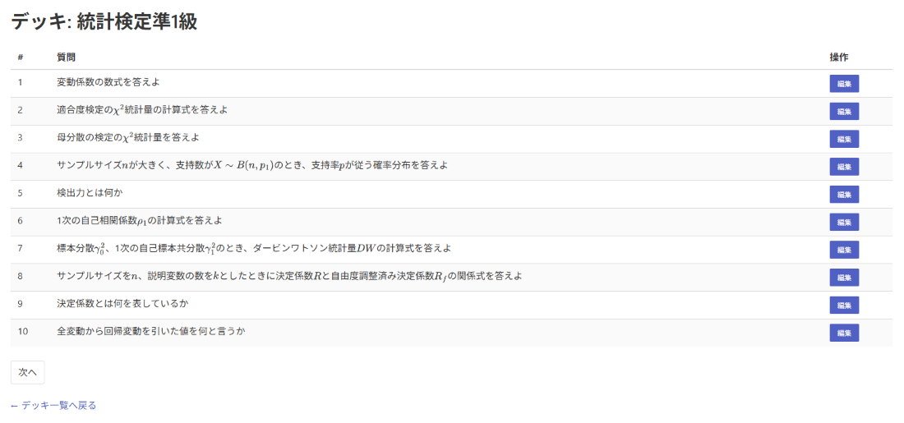

# Anki AI Editor

Ankiに登録された一問一答形式のカードを、生成AI（OpenAI API）を用いて自動推敲するツールです。

## 🚀 主な機能

- 🔍 AnkiConnect 経由で Anki に登録されたカード（質問・回答）を取得
- 🤖 ChatGPT API を使った回答の自動推敲

## 💡 使い方

### 1. ライブラリのインストール

```bash
uv sync
```

`uv` が未導入の場合は[Installing uv](https://docs.astral.sh/uv/getting-started/installation/)を参照してください。

### 2. `.env`ファイルの作成

`.env.sample` をコピーして `.env` ファイルを作成し、環境に合わせて値を設定してください。

```env
ACCESS_KEY=your_access_key          # AnkiConnect の Config に設定した apiKey 値（認証が有効な場合のみ必要）
SERVER_IP=your_server_ip            # AnkiConnect サーバーの IP アドレス（通常はlocalhost）
SERVER_PORT=your_server_port        # AnkiConnect サーバーのポート（通常は8765）
OPENAI_API_KEY=your_openai_api_key  # OpenAI の API キー
OPENAI_MODEL=your_openai_model      # 使用するモデル名（例：gpt-4o）
```

### 3. 起動

```bash
python src/flask_app.py
```

### 4. ブラウザでアクセス

`http://127.0.0.1:5050/` にアクセスすると、Anki に登録されたデッキを選択し、各カードの自動推敲・編集が可能です。

### 5. 画面イメージ

カード一覧画面の例：



## 📌 注意事項

- このツールの使用には AnkiConnect のインストールと Anki の起動が必要です
- 編集されたカードには自動で `edited` タグが付与されます
